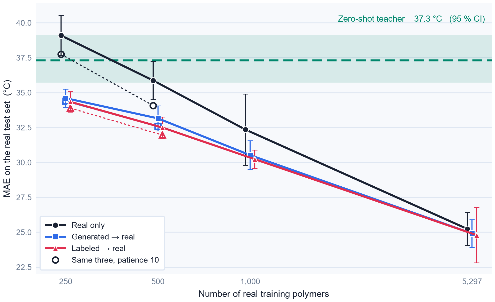

# Language-model-derived training data for polymer glass transition prediction

Code, data and per-run outputs for the preprint
[10.26434/chemrxiv.15009353/v1](https://doi.org/10.26434/chemrxiv.15009353/v1).

[](https://doi.org/10.26434/chemrxiv.15009353/v1)
[](https://doi.org/10.5281/zenodo.15789599)
[](LICENSE)

Can data written by a large language model replace or supplement experimental measurements for
predicting the glass transition temperature (Tg) of polymers? We ask Claude Sonnet 5 for two kinds of
synthetic data — a **generated** set, where it invents both the repeat unit and the Tg, and a
**labeled** set, where it assigns a Tg to hypothetical [PI1M](https://github.com/RUIMINMA1996/PI1M)
structures — and benchmark both against real measurements on a common held-out test set, along a
learning curve of 250 to 5,297 real polymers, with controls that separate the value of the LLM's Tg
values from the value of merely seeing more structures.

**Answer: supplement, not substitute, and only when measurements are scarce.**

| MoLFormer trained on | Test MAE (°C) |
|---|---|
| 5,297 real polymers | **25.2** ± 1.2 |
| generated set alone (7,912) | 36.8 ± 0.6 |
| labeled set alone (9,925) | 38.5 ± 0.7 |
| *Claude Sonnet 5, zero-shot* | *37.3* |
| 250 real only, patience 3 (main protocol) | 39.1 ± 1.4 |
| 250 real only, patience 10 (trained to convergence) | 37.7 ± 0.7 |
| 250 real, after a synthetic first stage (patience 3) | 34.3 ± 0.7 (labeled), 34.6 ± 0.6 (generated) |

Against a real-only baseline trained to convergence (early stopping with a patience of ten epochs),
a synthetic first stage is worth 3–4 °C at 250 real polymers on every seed, and about 2 °C at 500
for the labeled set (every seed) while the generated set's 1.5 °C there is within the seed-to-seed
noise. Against the main protocol's impatient baseline (patience 3) the same gains read 3–5 °C, so
16–23 % of the originally observed gain at 250 and 39–48 % at 500 came from stopping the baseline too early.
At 1,000 real polymers the gain is about 2 °C and inconsistent; at 5,297 it is gone. Shuffling the
teacher's Tg values destroys the gain, so it comes from its Tg knowledge and not from seeing more
structures; self-training pseudo-labels recover about 40 % of it. 8.3 % of the "generated" polymers
turn out to be memorized copies of real database entries, and the LLM's labels are rounded to a few
values and biased low. The two datasets cost USD 10.28 to produce (11.26 including the zero-shot
evaluation of the test set).



*MAE on the real test set against the number of real training polymers (mean ± SD over 5 seeds, series
offset slightly sideways for legibility). Open symbols are the same three configurations trained to
convergence (patience 10); the green dashed line and band are Claude Sonnet 5's zero-shot MAE and its
95 % bootstrap interval. This is Figure 3 of the paper.*

Plain-language walkthrough of every result: [`results/SUMMARY.md`](results/SUMMARY.md).

## Reproduce

```bash
pip install -r requirements.txt          # pinned to the versions used for the paper (Python 3.14)
cp .env.example .env                     # only needed to re-query the API; add ANTHROPIC_API_KEY

python pipeline/run.py                   # every step that is missing or out of date, in dependency order
python pipeline/run.py --list            # the steps and whether each is up to date
python pipeline/run.py analyze figures   # only these steps
python -m pytest                         # the fast tests; `-m slow` instead runs the one-epoch CPU smoke test
```

[`pipeline/run.py`](pipeline/run.py) holds the dependency order as a plain table of steps, inputs and
outputs, and runs each step as a subprocess. Every step is one script that can also be run by hand
from any directory (`python pipeline/<script>.py`, `python report/<script>.py`), in this order:

| Step (`run.py` name) | Script | Writes |
|---|---|---|
| download | `pipeline/download_data.py` | `data/raw/` (Zenodo file, md5-checked; PI1M) |
| prepare | `pipeline/prepare_real_data.py` | `data/real_clean.csv`, `train_real.csv`, `val_real.csv`, `test_real.csv` |
| api (only when named) | `pipeline/generate_with_claude.py`, `label_pi1m_with_claude.py`, `zero_shot_with_claude.py` | `data/*_raw.csv`, `results/zero_shot_predictions.csv` |
| clean | `pipeline/clean_synthetic_data.py` | `data/generated_clean.csv`, `data/labeled_clean.csv` |
| describe, memorization, score_zero_shot | `pipeline/describe_split.py`, `memorization.py`, `score_zero_shot.py` | `results/test_similarity.csv`, `memorization.csv`, `zero_shot_metrics.json`, `api_cost.csv` |
| train_molformer, train_random_forest | `pipeline/train_molformer.py`, `train_random_forest.py` | `results/runs/*.json`, `results/predictions/*.csv`, `results/stage1_weights/` |
| inference_noise, patience_ablation | `pipeline/inference_noise.py`, `patience_ablation.py` | `results/tables/inference_noise.csv`, `results/patience_ablation.jsonl` |
| analyze | `pipeline/analyze_results.py` | `results/results.csv`, `results_summary.csv`, `results/tables/*.csv` |
| tables, figures | `report/make_tables.py`, `report/make_figures.py` | `results/tables/latex/*.tex`, `results/figures/*.pdf` and `.png` |

The API scripts are **not** needed to reproduce the results: every raw response is already in
`data/claude_responses/`, and a request whose id has a saved response is never re-sent. All
settings live in `pipeline/config.py`. `inference_noise.py` and `patience_ablation.py` need the
stage-1 weights in `results/stage1_weights/`, which are not in the repository (180 MB per model) and
are written by `train_molformer.py`; their outputs are committed.

Training runs are resumable: a run whose record exists is skipped, but only if the record's
`settings_hash` matches the current settings; otherwise the script stops with a message
(`pipeline/common/resume.py`). `run.py` reruns the training steps only when their outputs are
missing, never because a data file is merely newer, so a regenerated data file cannot trigger a
29-GPU-hour rerun by accident. `train_molformer.py --patience 10 --max-epochs 40` is the setting of
the patience ablation; `patience_ablation.py` runs exactly the 30 low-data runs of the paper with it.

120 MoLFormer runs and 40 random-forest runs, plus the 30-run early-stopping ablation: about
29 GPU-hours on one RTX 3050 laptop GPU and 3 CPU-hours.

## Which script makes which table and figure

All numbers in the manuscript are macros from `results/tables/latex/numbers.tex`; nothing is typed by
hand. Figure 1 (the pipeline overview) is drawn in TikZ in the manuscript source.

| In the paper | Script | Output file |
|---|---|---|
| Table 1, run matrix | `report/make_tables.py` | `results/tables/latex/run_matrix.tex` |
| Table 2, cleaning counts | `report/make_tables.py` | `results/tables/latex/cleaning_counts.tex` |
| Table 3, Tg statistics | `report/make_tables.py` | `results/tables/latex/dataset_stats.tex` |
| Table 4, learning curve | `pipeline/analyze_results.py` → `report/make_tables.py` | `results/results_summary.csv`, `tables/patience_ablation.csv` → `latex/results_main.tex` |
| Table 5, controls | `pipeline/analyze_results.py` → `report/make_tables.py` | `results/results_summary.csv` → `latex/controls.tex` |
| Figure 2, Tg distributions | `report/make_figures.py` | `results/figures/fig_tg_distributions.pdf` |
| Figure 3, learning curve | `report/make_figures.py` | `results/figures/fig_learning_curve.pdf` |
| Figure 4, controls | `report/make_figures.py` | `results/figures/fig_controls.pdf` |
| Figure 5, predicted vs measured | `report/make_figures.py` | `results/figures/fig_predicted_vs_true.pdf` |
| Table S1, settings | `report/make_tables.py` (from `config.py`) | `latex/hyperparameters.tex` |
| Table S2, API cost | `pipeline/score_zero_shot.py` → `report/make_tables.py` | `results/api_cost.csv` → `latex/cost_full.tex` |
| Table S3, top label values | `report/make_tables.py` | `latex/labeled_top_values.tex` |
| Table S4, zero-shot by Tg band | `report/make_tables.py` | `latex/zero_shot_bands.tex` |
| Table S5, memorization | `pipeline/memorization.py` → `report/make_tables.py` | `results/memorization.csv` → `latex/memorization.tex` |
| Table S6, all metrics | `pipeline/analyze_results.py` → `report/make_tables.py` | `results/results_summary.csv` → `latex/results_full.tex` |
| Table S7, per-seed MAE | `pipeline/analyze_results.py` → `report/make_tables.py` | `results/results.csv` → `latex/per_seed_molformer.tex` |
| Table S8, best epochs | `pipeline/analyze_results.py` → `report/make_tables.py` | `results/results.csv` → `latex/best_epochs.tex` |
| Table S9, student vs teacher | `pipeline/analyze_results.py` → `report/make_tables.py` | `results/tables/student_vs_teacher.csv` → `latex/student_vs_teacher.tex` |
| Table S10, noise floor | `pipeline/analyze_results.py` → `report/make_tables.py` | `results/tables/noise_floor.csv` → `latex/noise_floor.tex` |
| Table S11, MAE by Tg band | `pipeline/analyze_results.py` → `report/make_tables.py` | `results/tables/mae_by_tg_bin.csv` → `latex/mae_by_tg_bin.tex` |
| Table S12, MAE by similarity | `pipeline/describe_split.py` → `analyze_results.py` → `report/make_tables.py` | `results/tables/mae_by_similarity_bin.csv` → `latex/mae_by_similarity.tex` |
| Table S13, inference noise | `pipeline/inference_noise.py` → `report/make_tables.py` | `results/tables/inference_noise.csv` → `latex/inference_noise.tex` |
| Table S14, all seed-matched comparisons | `pipeline/analyze_results.py` → `report/make_tables.py` | `results/tables/seed_matched_comparisons.csv` → `latex/paired_differences_full.tex` |
| Table S15, patience ablation | `pipeline/patience_ablation.py` → `analyze_results.py` → `report/make_tables.py` | `results/patience_ablation.jsonl` → `tables/patience_ablation.csv` → `latex/patience_ablation.tex` |
| Figure S1, repetition and rounding | `report/make_figures.py` | `results/figures/fig_si_repetition_rounding.pdf` |
| Figure S2, MAE vs similarity | `pipeline/analyze_results.py` → `report/make_figures.py` | `results/figures/fig_si_similarity.pdf` |
| Figure S3, zero-shot error | `report/make_figures.py` | `results/figures/fig_si_zero_shot_error.pdf` |

## What is here

```
pipeline/        the study, one script per step, and run.py to run them in order; config.py holds every setting
  common/        Claude batch API, the two prompts, SMILES cleaning and the polymer keys,
                 the MoLFormer training loop, the resume check
report/          the tables (LaTeX + number macros) and figures of the paper, drawn from results/ and data/
tests/           pytest: polymer keys and cleaning rules, the runner; a slow CPU smoke test of the training code
data/            the two synthetic sets, the cleaned real data and the three splits
  claude_responses/   every raw LLM response, one JSON line per request
results/         predictions/ and runs/ (one CSV + one JSON per training run), tables/ (CSV) and
                 tables/latex/ (the paper's tables and number macros), figures/,
                 pseudo_labels/ (the self-training labels), logs/ (run logs),
                 patience_ablation.jsonl, run_info.json, SUMMARY.md
```

Two details that matter for anyone reusing this:

- **Polymer identity.** The same chain can be cut into different repeat units (`*CCO*` = `*COC*`), so
  two polymers count as identical if they match on *either* the canonical SMILES *or* a cut-invariant
  ring-closure key ([`pipeline/common/cleaning.py`](pipeline/common/cleaning.py)). Exact matching alone
  would have missed almost a third of the test polymers that the LLM reproduced verbatim.
- **Reproducibility.** MoLFormer's linear attention redraws random features on every forward pass
  (`deterministic_eval = False`, left as shipped), so results reproduce statistically, not bit for bit.
  `results/run_info.json` records the dataset checksum, prompts, request counts, costs and software
  versions.

## Data

Real Tg data: the curated collection of Kunchapu and Jablonka,
[10.5281/zenodo.15789599](https://doi.org/10.5281/zenodo.15789599), CC BY 4.0.
PI1M: [RUIMINMA1996/PI1M](https://github.com/RUIMINMA1996/PI1M).
Both full datasets are downloaded by `pipeline/download_data.py` and are not redistributed here. What
`data/` does contain is derived from them: the cleaned real collection and its splits (from the Zenodo
file, under its CC BY 4.0 terms) and `pi1m_sample.csv`, the 10,000 PI1M structures that were sent to
the LLM (under the terms of the PI1M repository). See [`LICENSE`](LICENSE).

## Citation

```bibtex
@article{rusev2026llmtg,
  title   = {Language-model-derived training data for polymer glass transition
             prediction: a controlled benchmark},
  author  = {Rusev, Rostislav},
  journal = {ChemRxiv},
  year    = {2026},
  doi     = {10.26434/chemrxiv.15009353/v1}
}
```

A tagged release of this repository will be archived on Zenodo; **TODO: add the Zenodo DOI here once minted.**

## License

Code: [MIT](LICENSE). Derived data produced for this study (the synthetic datasets, raw LLM
responses and everything under `results/`): CC BY 4.0. The real Tg data remain CC BY 4.0 under the
terms of their original Zenodo record; PI1M under the terms of its repository. See the notes at the
end of [`LICENSE`](LICENSE).
