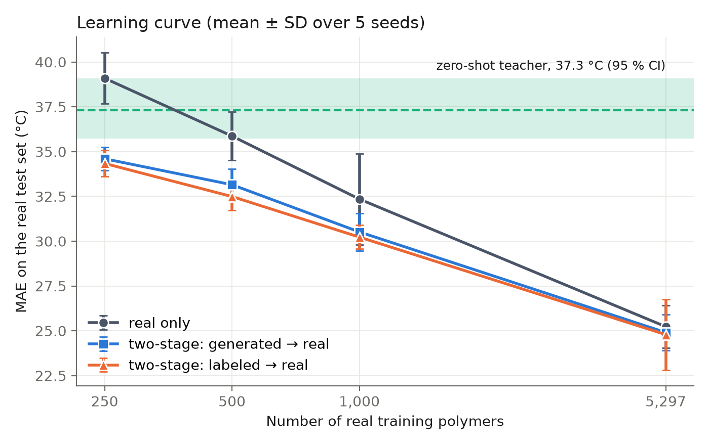

# Language-model-derived training data for polymer glass transition prediction

Code, data and per-run outputs for the paper.

[](https://doi.org/10.26434/chemrxiv-2026-XXXXX)

Can data written by a large language model replace or supplement experimental measurements for
predicting the glass transition temperature (Tg) of polymers? We ask Claude Sonnet 5 for two kinds of
synthetic data - a **generated** set, where it invents both the repeat unit and the Tg, and a
**labeled** set, where it assigns a Tg to hypothetical [PI1M](https://github.com/RUIMINMA1996/PI1M)
structures - and benchmark both against real measurements on a common held-out test set.

**Answer: supplement, not substitute, and only when measurements are scarce.**

| MoLFormer trained on | Test MAE (°C) |
|---|---|
| 5,297 real polymers | **25.2** ± 1.2 |
| generated set alone (7,912) | 36.8 ± 0.6 |
| labeled set alone (9,925) | 38.5 ± 0.7 |
| *Claude Sonnet 5, zero-shot* | *37.3* |
| 250 real only | 39.1 ± 1.4 |
| 250 real, after a synthetic first stage | 34.3 ± 0.7 |

A synthetic first stage is worth 3–5 °C at 250–500 real polymers, ~2 °C at 1,000, and nothing at
5,297. Shuffling the teacher's Tg values destroys the gain, so it comes from its Tg knowledge and not
from seeing more structures. 8.3 % of the "generated" polymers turn out to be memorised copies of real
database entries. The two datasets cost USD 11.26 to produce.



Plain-language walkthrough of every result: [`results/SUMMARY.md`](results/SUMMARY.md).

## Reproduce

```bash
pip install -r requirements.txt          # pinned to the versions used for the paper
cp .env.example .env                     # only needed to re-query the API; add ANTHROPIC_API_KEY

python pipeline/download_data.py         # Zenodo (md5-checked) + PI1M
python pipeline/prepare_real_data.py     # clean, dedupe, split 5,297 / 589 / 1,471
python pipeline/clean_synthetic_data.py  # six rules; test+validation polymers removed
python pipeline/train_molformer.py       # 120 runs, 5 seeds, resumable
python pipeline/train_random_forest.py
python pipeline/analyze_results.py       # every table in results/tables/
python pipeline/make_figures.py
```

Run everything from the repository root. The API scripts (`generate_with_claude.py`,
`label_pi1m_with_claude.py`, `zero_shot_with_claude.py`) are **not** needed to reproduce the results:
every raw response is already in `data/claude_responses/`, and a request whose id has a saved response
is never re-sent. All settings live in `pipeline/config.py`.

160 training runs, plus a 30-run early-stopping ablation (`pipeline/patience_ablation.py`):
about 29 GPU-hours on one RTX 3050 laptop GPU.

## What is here

```
pipeline/        the whole study, one script per step; config.py holds every setting
  common/        Claude batch API, the two prompts, SMILES cleaning and the polymer keys
data/            the two synthetic sets, the cleaned real data and the three splits
  claude_responses/   every raw LLM response, one JSON line per request
results/         predictions/ and runs/ (one CSV + one JSON per training run), tables/,
                 figures/, patience_ablation.jsonl, run_info.json, SUMMARY.md
```

Two details that matter for anyone reusing this:

- **Polymer identity.** The same chain can be cut into different repeat units (`*CCO*` = `*COC*`), so
  two polymers count as identical if they match on *either* the canonical SMILES *or* a cut-invariant
  ring-closure key ([`pipeline/common/cleaning.py`](pipeline/common/cleaning.py)). Exact matching alone
  would have missed a third of the test polymers that the LLM reproduced verbatim.
- **Reproducibility.** MoLFormer's linear attention redraws random features on every forward pass
  (`deterministic_eval = False`, left as shipped), so results reproduce statistically, not bit for bit.
  `results/run_info.json` records the dataset checksum, prompts, request counts, costs and software
  versions.

## Data

Real Tg data: the curated collection of Kunchapu and Jablonka,
[10.5281/zenodo.15789599](https://doi.org/10.5281/zenodo.15789599), CC BY 4.0.
PI1M: [RUIMINMA1996/PI1M](https://github.com/RUIMINMA1996/PI1M).
Both are downloaded by `pipeline/download_data.py` and are not redistributed here.

## Citation

```bibtex
@article{rusev2026llmtg,
  title   = {Language-model-derived training data for polymer glass transition
             prediction: a controlled benchmark},
  author  = {Rusev, Rostislav},
  journal = {ChemRxiv},
  year    = {2026},
  doi     = {10.26434/chemrxiv-2026-XXXXX}
}
```
